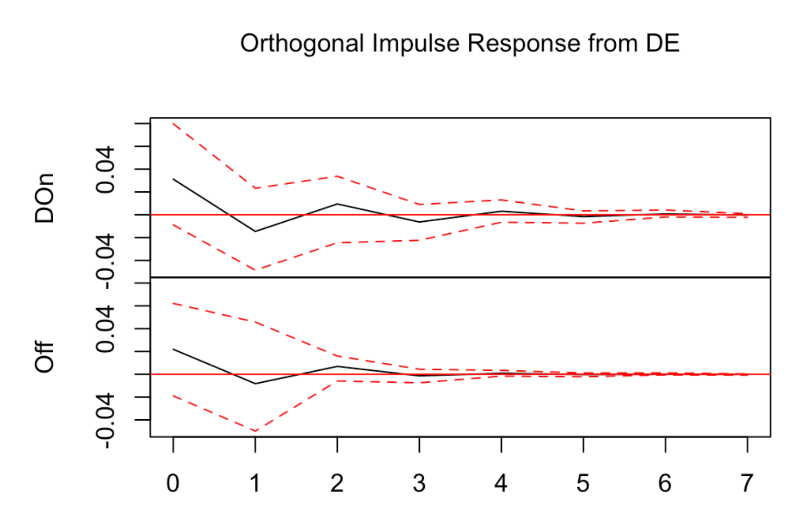

# relationship_marketing_channels_-_sales_performances

## Table of Contents
1. [Objective](#1-objective)  
2. [Context](#2-context)  
3. [Methodologies](#3-methodologies)  
   - [A. Data Preprocessing](#a-data-preprocessing)  
   - [B. Vector Autoregression Model](#b-vector-autoregression-model)  
   - [C. Impulse Reaction Function Analysis](#c-impulse-reaction-function-analysis)  
4. [Advice from the Analysis](#4-advice-from-the-analysis)  

---

## 1. Objective

The objective of this report is to **analyse the dynamic relationships among marketing channel spendings and sales performance metrics**.

In today's competitive business landscape, effective allocation of marketing budgets is crucial for maximising sales and revenue growth.
However, with the proliferation of digital marketing channels and evolving consumer behaviour, understanding the intricate relationships between marketing expenditures and sales outcomes has become increasingly complex.

Through **Vector Autoregressive (VAR)** models and **Impulse Response Function (IRF)** analysis, we aim to uncover the short- and long-term effects of marketing expenditures on sales performance and identify optimal budget allocations for each marketing channel.
By analysing the dataset, this report provides actionable insights for marketing managers and decision-makers to refine marketing strategies, enhance resource allocation efficiency, and ultimately drive sustainable business growth.

---

## 2. Context

The chosen dataset is the **B2B Furniture Omnichannel Dataset**, which contains weekly records of marketing activities and sales revenues for a retail company.

### Useful Variables

| Variable | Description |
|-----------|--------------|
| **Flyer** | Weekly amount spent on flyers |
| **Catalog** | Weekly amount spent on catalogs |
| **Adwords** | Weekly amount spent on Google Adwords campaigns |
| **Emailing** | Weekly number of emails sent |
| **Discounts** | Weekly discounts applied (%) |
| **Online orders** | Weekly number of orders via the website |
| **Offline orders** | Weekly number of orders via sales representatives, phone, or mail |
| **Revenues** | Weekly sales revenues |

---

## 3. Methodologies

### A. Data Preprocessing

Before analysis, the dataset needs to be preprocessed.

To determine optimal budget allocation, we used the variables **Flyer**, **Catalog**, **Adwords**, and **Emailing**.  
Since only three of these represent actual budgets, the price per email sent was assumed to be **$0.10** to integrate email campaigns into the marketing budget.

> *Figure 1: Current Budget Allocation*  
> 

Observations:
- Offline sales occur **2.6×** more frequently than online sales.
- Regression results show **offline orders contribute 3× more** to revenue growth.
  
Therefore, improving online sales while maintaining overall revenue growth is an important strategic focus.

Before modeling:
- All variables were **log-transformed** for interpretability and variance stabilisation.  
- Time series were created for each relevant variable.

---

### B. Vector Autoregression Model

A **VAR model** captures the dynamic relationships among multiple time-series variables by regressing each variable on its own lagged values and those of the others.

$$
Y_t = A_0 + A_1 Y_{t-1} + A_2 Y_{t-2} + \varepsilon_t
$$

Where:
- \( Y_t \): vector of endogenous variables at time *t*  
- \( A_0 \): constant term  
- \( A_i \): coefficient matrices  
- \( \varepsilon_t \): vector of error terms  

#### Stationarity

The VAR model assumes stationarity.  
We applied the **Augmented Dickey-Fuller (ADF) test)**, revealing that:

- `Adwords`, `Emailing`, and `Online_orders` were **non-stationary**  
- Their **first differentiation** were used for further analysis  

#### Exogeneity

A **Granger causality test** indicated that `Discounts` have a significant causal and instantaneous relationship with other variables.  
Therefore, `Discounts` were treated as an **exogenous variable**.  
A lag of **1** was selected.

> *Figure 2: VAR Model Coefficients*  
> 

#### Interpretation

- **Online sales** are mostly influenced by `Adwords` and previous online/offline sales.  
- **Offline sales** are mainly influenced by previous offline sales and `Discounts`.  
- **Carryover effects** were observed in `Flyer`, `Emailing`, `Online_orders`, and `Offline_orders`.

Residual plots showed randomness around zero with minor autocorrelation at lag 2.  
To avoid overfitting, a lag of **1** was retained.

> *Figure 3: ACF plots of the online (top) and offline (bottom) residuals*  
> 
> 

---

### C. Impulse Reaction Function Analysis

To assess short- and long-term effects, an **Orthogonalised Impulse Response Function (IRF)** was used.  
Orthogonalisation isolates the unique impact of shocks on each response variable.

> *Figure 4: IRF plots*  
> 
> 
> 
> 

#### Key Observations
- Online and offline orders respond **positively and immediately** to most impulses except `Adwords`.  
- Online sales react **positively after one period** to `Adwords`, while offline sales react **negatively**.  
- The strongest effect is **Flyer → Offline Orders**, remaining positive for three periods.  
- Some responses (e.g., `Emailing` and `Adwords` on certain variables) are **non-significant**.

#### Persistence
- Effects of `Adwords` and `Emailing` on online orders persist **4–5 periods**.  
- Effects on offline orders persist about **3 periods**.

---

### Long-Term Elasticities

| Channel | Online Orders | Offline Orders |
|----------|----------------|----------------|
| **Adwords** | 0.0413 | 0.0011 |
| **Flyer** | 0.0862 | 0.1655 |
| **Catalog** | 0.0527 | 0.0655 |
| **Emailing** | 0.0312 | 0.0069 |

> *Figure 5: Aggregate Measures from IRF Coefficients*  

---

### Optimal Budget Allocation

Each channel’s optimal budget share was computed based on its long-term elasticity:

$$
w_i = \frac{E_i}{\sum E_i}
$$

> *Figure 6: Optimal Budget Allocation*  
> 

Compared to the current allocation:
- **Flyer** spending should decrease.  
- **Catalog** spending should increase.

> *Figure 7: Optimal budget allocation for offline sales*  
> 
> *Figure 8: Optimal budget allocation for online sales*  
> 

These findings confirm:
- Flyers have major impact on **offline** sales.  
- Adwords significantly drive **online** sales.  
- Emailing has minimal effect on both.

---

## 4. Advice from the Analysis

Based on the optimal allocations:

- Invest in **both online and offline** marketing channels.  
- Balance the budget to leverage each channel’s strengths.  
- Increase investment in **Google Adwords** and **Email campaigns** to boost online sales.  
- Continue **Flyers** for short-term offline gains and **Catalogs** for long-term customer engagement.  
- Continuously **monitor performance** and adjust budgets using data analytics.  

### Expected Outcomes
- Increased total revenues  
- Reduced gap between online and offline sales  
- Improved marketing efficiency  
- Sustainable growth across both sales channels  

---

### Summary
By applying statistical models like VAR and IRF, this analysis identifies how different marketing channels interact dynamically.  
The insights guide budget optimisation and enable the company to allocate resources effectively to maximise both online and offline performance.

---
